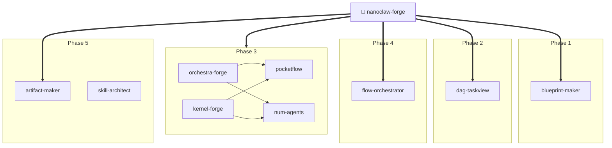

# AI Skills Collection

A collection of skills for [Claude Code](https://claude.ai/code) — importable directly into your IDE

## What are Skills?

Skills are reusable prompt workflows for Claude Code. They live in `~/.claude/skills/` and are triggered automatically by Claude when your request matches the skill's description.

Each skill is a folder with a `SKILL.md` file:

```
~/.claude/skills/
└── my-skill/
    └── SKILL.md    ← frontmatter (name + description) + workflow
```

## Available Skills (19)

### 🔷 Meta / Orchestration

| Skill | Description |
|-------|-------------|
| [`nanoclaw-forge`](./skills/nanoclaw-forge/) | **Unified meta-skill** — fuses ALL skills into a 5-phase pipeline: PLAN → MAP → BUILD → RUN → SHIP |
| [`orchestra-forge`](./skills/orchestra-forge/) | Full-stack agent builder: Nüm Agents spec → PocketFlow code → Skill Architect audit |
| [`kernel-forge`](./skills/kernel-forge/) | Multi-tenant kernel builder using Os-frame patterns — policy gate, idempotency, SSE streaming |
| [`flow-orchestrator`](./skills/flow-orchestrator/) | Pipeline runtime with tracing, snapshots, pause/resume, and execution visualization |

### 🧩 Components

| Skill | Description |
|-------|-------------|
| [`blueprint-maker`](./skills/blueprint-maker/) | Generate structured blueprints for any domain — auto-detect business/product/research/education/engineering |
| [`dag-taskview`](./skills/dag-taskview/) | Visualize tasks as DAGs — dependency tracking, critical path, Mermaid diagrams, progress persistence |
| [`artifact-maker`](./skills/artifact-maker/) | Multi-format output engine — MD, JSON, PDF, charts, audio (TTS), video, with manifest tracking |
| [`pocketflow`](./skills/pocketflow/) | Build LLM-powered workflows with PocketFlow — nodes, flows, async, batch, retries |
| [`num-agents`](./skills/num-agents/) | Build AI agents with the Nüm Agents SDK — universe-based architecture, YAML specs |
| [`agent-pocketflow`](./skills/agent-pocketflow/) | **Hybrid example agent** — PocketFlow + Nüm Agents doc-update agent with multi-provider LLM, ASCII dashboard |

### 🛠️ Dev Tools

| Skill | Description |
|-------|-------------|
| [`skill-architect`](./skills/skill-architect/) | Multi-agent pipeline (Architect → Refactorer → Reviewer → Security → Docs) to audit skills |
| [`skill-creator`](./skills/skill-creator/) | Guide for creating new skills: structure, frontmatter, best practices |
| [`skill-ide-setup`](./skills/skill-ide-setup/) | Configure projects for AI-powered IDEs (Cursor, Windsurf, Trae, Cline) |
| [`ui-style-generator`](./skills/ui-style-generator/) | Generate full UI Design Systems — color tokens, typography, spacing, CSS vars |
| [`commit`](./skills/commit/) | Create well-formatted git commits with conventional commit format |
| [`review-pr`](./skills/review-pr/) | Review GitHub Pull Requests — bugs, security, design, tests |
| [`mcp-builder`](./skills/mcp-builder/) | Build production MCP servers — 4-phase workflow, TypeScript/Python SDK guides, evaluation harness |

### ⚙️ System

| Skill | Description |
|-------|-------------|
| [`session-start-hook`](./skills/session-start-hook/) | SessionStart hooks to install dependencies automatically |
| [`keybindings-help`](./skills/keybindings-help/) | Customize keyboard shortcuts |

## Skill Chain



## Install

### All skills

```bash
git clone <this-repo> aiskills
cd aiskills
chmod +x install.sh
./install.sh --all
```

### One specific skill

```bash
./install.sh session-start-hook
```

### Manual install

Copy any skill folder into `~/.claude/skills/`:

```bash
cp -r skills/session-start-hook ~/.claude/skills/
```

Then restart Claude Code.

## Add a Skill

1. Create a folder: `skills/your-skill-name/`
2. Add `SKILL.md` with this format:

```markdown
---
name: your-skill-name
description: One sentence describing when Claude should use this skill.
---

# Your Skill Title

Detailed workflow instructions for Claude...
```

1. PR welcome!
