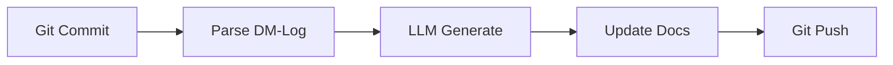

# Agent PocketFlow — Hybrid Example Agent

A **production-ready example** showing how to build an LLM-powered agent by combining:

- **PocketFlow** — Node/Flow engine with prep/exec/post lifecycle
- **Nüm Agents** — Universe-based YAML spec architecture

## What it does

Auto-updates project documentation by analyzing Git commits and using LLMs:



**Documents updated:**

- DM-Log (decision/meeting journal)
- MCD & Garde-fous (data model + guardrails)
- Project Structure
- Tasks
- Requirements

## Quick Start

### Run the full pipeline (test mode)

```bash
cd skills/agent-pocketflow
python scripts/agent.py --test-mode
```

### Run with Gemini

```bash
export GEMINI_API_KEY="your-key"
python scripts/agent.py --provider gemini
```

### Run specific flow only

```bash
python scripts/agent.py --flow dm-log --test-mode
```

## Architecture

```
┌─────────────────────────────────────────┐
│           agent.yaml (Nüm Agents)       │
│  Universes: PocketFlowCore,             │
│             StructureAgentIA,           │
│             KnowledgeLayer              │
├─────────────────────────────────────────┤
│           Flow Engine (PocketFlow)       │
│  Sequential node execution              │
│  ASCII dashboard + progress bar         │
│  Error handling per-node                │
├─────────────────────────────────────────┤
│           Nodes                         │
│  GitCommitNode → DMLogParserNode →      │
│  DMLogLLMNode → DMLogUpdateNode →       │
│  ModelConceptNode → StructureNode →     │
│  TasksNode → RequirementsNode →         │
│  GitPushNode                            │
├─────────────────────────────────────────┤
│          LLM Client                     │
│  Gemini / OpenAI / DeepSeek             │
│  Multi-provider, auto-detect API key    │
└─────────────────────────────────────────┘
```

## Key Patterns

### 1. BaseNode (prep/exec/post)

```python
from scripts.nodes.base_node import BaseNode

class MyNode(BaseNode):
    def __init__(self):
        super().__init__("my_node")
    
    def exec(self, context):
        # Your logic here
        context["result"] = "done"
        return context
```

### 2. LLM Node (multi-provider)

```python
from scripts.llm_client import LLMClient

llm = LLMClient(provider="gemini")  # or "openai", "deepseek"
response = llm.generate_text("Analyze this code...")
```

### 3. Flow Composition

```python
from scripts.flow import Flow

flow = Flow([
    MyNode(),
    AnotherNode(),
    FinalNode(),
], name="My Pipeline")

result = flow.run({"input": "data"})
```

### 4. Nüm Agents Spec

```yaml
# agent.yaml
agent:
  name: DocUpdateAgent
  univers:
    - PocketFlowCore
    - StructureAgentIA
    - KnowledgeLayer
flows:
  - name: full-update
    nodes: [git_commit, dm_log, mcd, structure, tasks, requirements, git_push]
```

## Create Your Own Agent

1. **Copy this skill** as a template
2. **Edit `agent.yaml`** — change universes, nodes, flows
3. **Create new nodes** in `scripts/nodes/` — extend `BaseNode`
4. **Add prompts** to `scripts/prompts.py`
5. **Wire the flow** in `scripts/agent.py`

## Integration with other skills

| Skill | How it integrates |
|-------|-------------------|
| `pocketflow` | Uses PocketFlow Node/Flow patterns |
| `num-agents` | Uses YAML spec + universe architecture |
| `orchestra-forge` | Use orchestra-forge to generate this agent type |
| `artifact-maker` | Export results as PDF/charts |
| `nanoclaw-forge` | Part of the BUILD phase |

## Providers & API Keys

| Provider | Env Variable | Default Model |
|----------|-------------|---------------|
| Gemini | `GEMINI_API_KEY` or `GOOGLE_API_KEY` | `gemini-2.5-flash` |
| OpenAI | `OPENAI_API_KEY` | `gpt-4o` |
| DeepSeek | `DEEPSEEK_API_KEY` | `deepseek-reasoner` |
