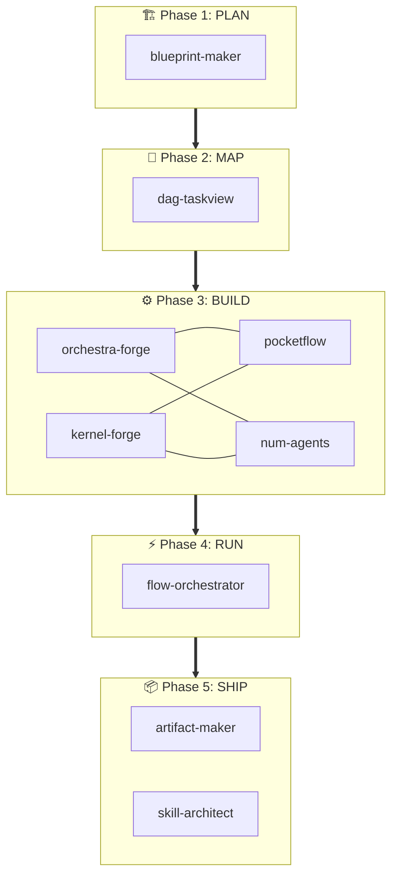

# Nanoclaw Forge — Unified Pipeline

The **one skill to rule them all**. Fuses 16 skills into a single 5-phase pipeline that takes a user goal from idea to shipped artifacts.

```
PLAN ──▶ MAP ──▶ BUILD ──▶ RUN ──▶ SHIP
```

## When to use

- User wants an **end-to-end** pipeline from idea to execution
- User says "forge", "full pipeline", "build everything"
- User wants to run **specific phases** of the pipeline

## Quick Start

Ask the user: **"What do you want to build?"**

Then ask which phases to run:

| Phase | Flag | What it does |
|-------|------|--------------|
| 1. PLAN | `--plan` | Generate a structured blueprint |
| 2. MAP | `--map` | Convert blueprint → visual DAG with dependencies |
| 3. BUILD | `--build` | Generate agent code (YAML spec + PocketFlow) |
| 4. RUN | `--run` | Execute the agent with tracing |
| 5. SHIP | `--ship` | Export artifacts (PDF, charts) + quality audit |

**Default: all phases.** User can pick any subset.

---

## Phase 1: PLAN (blueprint-maker)

**Input**: User's goal in one sentence  
**Output**: Structured blueprint markdown

Ask 3 quick questions:

1. **Goal**: "What's the desired outcome?"
2. **Constraints**: "Budget, timeline, resources?"
3. **Audience**: "Who is this for?"

Auto-detect the domain (business / product / research / education / engineering) and generate a full blueprint using `blueprint-maker`.

**Skill reference**: [../blueprint-maker/SKILL.md](../blueprint-maker/SKILL.md)

```python
from blueprint_maker.scripts.blueprint_engine import BlueprintEngine
engine = BlueprintEngine()
domain = engine.detect_domain(user_goal)
blueprint = engine.generate(domain=domain, goal=user_goal, constraints=constraints)
```

**Checkpoint ✅** — Show blueprint to user. Ask: "Does this plan look right? Want to adjust anything before we map it?"

---

## Phase 2: MAP (dag-taskview)

**Input**: Blueprint from Phase 1  
**Output**: DAG with task dependencies + critical path + Mermaid diagram

Convert blueprint phases/sections into a DAG of tasks with dependencies.

**Skill reference**: [../dag-taskview/SKILL.md](../dag-taskview/SKILL.md)

```python
from dag_taskview.scripts.dag_engine import DAGEngine

# Convert blueprint to tasks
tasks = blueprint_engine.to_dag_tasks(blueprint)

dag = DAGEngine(project_name=blueprint["meta"]["project_name"])
dag.load_dict(tasks)
dag.render("project_dag.md")
dag.summary()
```

The DAG shows:

- ✅ Done (green) / 🔄 In Progress (yellow) / ⏳ Pending (gray) / 🚫 Blocked (red)
- 🔥 Critical path highlighted
- ▶️ Ready-to-start tasks listed

**Checkpoint ✅** — Show DAG diagram. Ask: "Does this dependency tree look correct? Want to add/remove/reorder any tasks?"

---

## Phase 3: BUILD (orchestra-forge + kernel-forge + pocketflow + num-agents)

**Input**: DAG from Phase 2  
**Output**: `agent.yaml` + `agent.py` + PocketFlow wiring

Two build paths depending on scope:

### Path A: Single Agent (orchestra-forge)

For most projects. Creates one agent with PocketFlow nodes.

1. Map each DAG task → PocketFlow `Node`
2. Wire transitions from DAG dependencies
3. Generate `agent.yaml` (Nüm Agents spec)
4. Generate `agent.py` (PocketFlow implementation)

**Skill reference**: [../orchestra-forge/SKILL.md](../orchestra-forge/SKILL.md)

### Path B: Multi-Tenant Kernel (kernel-forge)

For enterprise/multi-user systems. Creates a full kernel with policy enforcement.

1. Map DAG tasks → kernel actions in `registry.yaml`
2. Generate kernel ports (Storage, Registry, WorldIndex, Planner, Hydrator, Tools)
3. Wire PocketFlow nodes as ToolRunner adapters
4. Add Policy Gate + idempotency

**Skill reference**: [../kernel-forge/SKILL.md](../kernel-forge/SKILL.md)

Both paths use:

- **PocketFlow**: [../pocketflow/SKILL.md](../pocketflow/SKILL.md) for execution engine
- **Nüm Agents**: [../num-agents/SKILL.md](../num-agents/SKILL.md) for universe selection

**Checkpoint ✅** — Show generated code. Ask: "Ready to run? Or want to adjust the agent first?"

---

## Phase 4: RUN (flow-orchestrator)

**Input**: Agent code from Phase 3  
**Output**: Traced execution results

Execute the agent pipeline with full observability:

```python
from flow_orchestrator.scripts.orchestrator import OrchestratorRuntime

runtime = OrchestratorRuntime(name="forge-run")
runtime.trace(agent_flow, shared_data)
runtime.snapshot("post-execution")
```

Features:

- **Tracing**: Every node transition logged with timestamps
- **Snapshots**: Save/restore execution state
- **Pause/Resume**: Interrupt long pipelines

**Skill reference**: [../flow-orchestrator/SKILL.md](../flow-orchestrator/SKILL.md)

**Checkpoint ✅** — Show execution trace + results. Ask: "Run looks good? Want to re-run or move to shipping?"

---

## Phase 5: SHIP (artifact-maker + skill-architect)

**Input**: Execution results from Phase 4  
**Output**: Exported artifacts + quality audit report

### 5A: Export Artifacts

Generate all outputs using `artifact-maker`:

```python
from artifact_maker.scripts.artifact_engine import ArtifactEngine

engine = ArtifactEngine(output_dir="./output")
engine.render("markdown", content=report, filename="report.md")
engine.render("pdf", title=project_name, content=report, filename="report.pdf")
engine.render("chart", data=metrics, filename="metrics.png")
engine.render("json", data=results, filename="results.json")
engine.save_manifest()
```

Supported formats: Markdown, JSON, YAML, CSV, PDF, PNG/SVG charts, HTML, Audio (TTS), Video

**Skill reference**: [../artifact-maker/SKILL.md](../artifact-maker/SKILL.md)

### 5B: Quality Audit

Run `skill-architect` 5-role audit on the generated code:

1. **Architecture Analyst** — Flow completeness, orphan nodes?
2. **Code Refactorer** — Error handling, hardcoded values?
3. **Skill Reviewer** — Spec matches implementation?
4. **Security Auditor** — Secrets, injection, timeouts?
5. **Documentation Enhancer** — Docstrings, README?

**Skill reference**: [../skill-architect/SKILL.md](../skill-architect/SKILL.md)

---

## Phase Selection

User can pick phases with flags:

```
"Just plan my project"           → Phase 1 only
"Plan and map it"                → Phases 1-2
"I have code, run and ship it"   → Phases 4-5
"Full pipeline"                  → All 5 phases
```

Always confirm which phases before starting.

---

## Complete Skill Chain



## Helper Skills (used across phases)

| Skill | Used In | Purpose |
|-------|---------|---------|
| `commit` | Any | Git commit between phases |
| `review-pr` | SHIP | Review generated PRs |
| `skill-creator` | BUILD | Create new skills from the pipeline |
| `ui-style-generator` | SHIP | Generate design systems for UI artifacts |
| `keybindings-help` | — | User convenience |
| `session-start-hook` | — | Auto-install deps |
| `skill-ide-setup` | — | IDE configuration |
